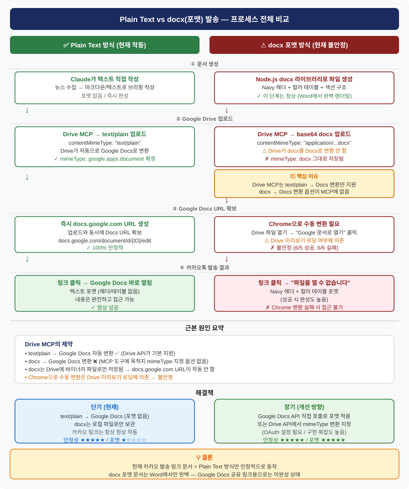

# docx 포맷 카카오 발송 실패기 — Plain Text로 돌아온 이유

어제(6월 5일) AI 뉴스 브리핑 자동화를 구축하면서 Navy 헤더와 컬러 테이블이 들어간 예쁜 docx 포맷 문서를 카카오톡으로 공유하려 했다. 결과는? 오늘(6월 6일) 같은 시도를 하다가 "파일을 열 수 없습니다"를 마주하고 결국 Plain Text 방식으로 되돌아왔다. 왜 그런지, 무엇을 배웠는지 기록한다.

## 원래 목표

카카오톡 나와의 채팅에 이런 메시지가 오도록 하고 싶었다.

```
🤖 AI 뉴스 브리핑 | 2026-06-06

★★★ WWDC 2026 D-2 — Apple, Gemini 탑재 차세대 Siri 공개 예정
★★★ 트럼프 AI 행정명령 — 기업 모델 출시 30일 전 사전 제출 요청
★★★ Alibaba Qwen 3.7-Max — Claude Opus 4.7 수준 성능에 절반 가격

📄 전체 문서 보기
https://docs.google.com/...

[전체 문서 확인]
```

그리고 링크를 탭하면 아래처럼 포맷이 살아있는 Google Docs 문서가 열리는 것.

- Navy 배경 제목 헤더 (날짜·카테고리 정보)
- 골드/파랑/초록 컬러로 구분된 하이라이트 테이블
- 섹션별 언더라인 헤딩과 출처·요약·시사점 구조

Node.js `docx` 라이브러리로 만든 파일을 Word에서 열면 실제로 이렇게 완벽하게 나온다. 문제는 이걸 카카오 공유 링크로 만드는 과정에서 생겼다.

---

## 실패의 전말

### 시도 1 — Drive MCP로 docx 업로드

Claude Cowork의 Google Drive MCP 도구로 docx 파일을 base64 인코딩해서 업로드했다. 파일 업로드 자체는 성공한다. 하지만 결과 mimeType이 문제였다.

```
결과: mimeType = application/vnd.openxmlformats-officedocument.wordprocessingml.document
기대: mimeType = application/vnd.google-apps.document
```

Drive MCP는 `text/plain` 업로드만 Google Docs로 자동 변환해준다. docx는 그냥 바이너리 파일로 저장되고 끝이다.

`docs.google.com/document/d/{ID}/edit` URL로 접근하면 **"파일을 열 수 없습니다"** 가 뜬다. Drive 파일인데 Docs URL로 열려고 해서 생기는 오류다.

### 시도 2 — Chrome 자동화로 "Google 문서로 열기" 클릭

Claude in Chrome MCP로 브라우저를 제어해서 Drive 미리보기 페이지의 "Google 문서(으)로 열기" 버튼을 클릭하는 방법을 썼다. 6월 5일에는 이게 됐다.

```
6/5: Drive 미리보기 정상 로드 → 버튼 클릭 → Google Docs 탭 열림 → URL 획득 ✅
6/6: Drive 미리보기 로딩 실패 ("파일을 미리 볼 수 없습니다") → 버튼 접근 불가 ✗
```

미리보기 로딩이 실패하면 버튼이 나타나지 않아서 아무것도 할 수 없었다. Drive 서버가 파일을 처리 중인 타이밍 문제인지, 파일 자체의 문제인지 정확한 원인은 불명확했다.

---

## 왜 이런 구조적 한계가 생기는가

아래 다이어그램이 두 방식의 전체 프로세스를 보여준다.



핵심은 **Drive API의 변환 규칙**이다.

Google Drive API는 특정 MIME 타입의 파일을 업로드할 때 자동으로 Google Workspace 포맷으로 변환해준다. 그런데 지원하는 변환 목록이 제한적이다.

| 업로드 타입 | Google Workspace 변환 |
|---|---|
| `text/plain` | Google Docs ✅ |
| `text/csv` | Google Sheets ✅ |
| `application/...docx` | ❌ 변환 없음 |

Drive MCP 도구에는 업로드 후 변환할 목적지 mimeType을 별도로 지정하는 파라미터가 없다. 원래 Drive API에는 이 기능이 있지만(`mimeType: application/vnd.google-apps.document`를 파일 메타데이터에 지정), MCP 래퍼가 이 옵션을 노출하지 않는다.

결국 docx는 Drive에 "Word 파일"로 저장되고, Google Docs 링크를 만들려면 Drive UI에서 수동으로 "Google 문서로 열기"를 눌러야 한다. 이 수동 단계를 Claude in Chrome으로 자동화했는데, Drive 미리보기 로딩 여부라는 외부 변수에 의존하게 되어 불안정했다.

---

## 최종 해결 — Plain Text로 원점 복귀

```python
# 이 방식은 항상 작동한다
result = drive_mcp.create_file(
    title="AI 뉴스 브리핑 2026-06-06",
    contentMimeType="text/plain",
    textContent=briefing_text,  # 포맷 없는 순수 텍스트
    parentId=FOLDER_ID
)
# → mimeType: application/vnd.google-apps.document ✅
# → docs.google.com/document/d/{ID}/edit 즉시 작동
```

카카오 발송은 이 URL로 이루어진다. 링크를 탭하면 Google Docs가 바로 열리고, 전체 브리핑 내용을 읽을 수 있다. 포맷은 없지만 접근성은 100%.

---

## 정리

| | Plain Text | docx 포맷 |
|---|---|---|
| 문서 포맷 | 없음 (텍스트) | Navy 헤더, 컬러 테이블 |
| Word에서 열기 | ⚠️ 밋밋함 | ✅ 완벽한 렌더링 |
| Google Docs 링크 | ✅ 즉시 생성 | ❌ 추가 변환 필요 |
| 카카오 링크 안정성 | ✅ 100% | ⚠️ 불안정 |
| 자동화 복잡도 | 낮음 | 높음 |

**현재 결론:** 카카오 발송 링크는 Plain Text Google Docs로 고정. docx는 로컬에서 Word로 열어보는 용도로만 사용.

**장기 개선 방향:** Google Docs API를 Python으로 직접 호출해서 programmatically 포맷을 적용하거나, Drive API에서 docx 업로드 시 목적지 mimeType을 명시적으로 Google Docs로 지정하는 방법을 구현해야 한다. 둘 다 별도의 OAuth 설정과 구현이 필요하다.

---

완벽한 포맷을 추구하다가 링크 자체가 깨지는 것보다, 포맷은 포기하더라도 항상 열리는 링크를 카카오로 받는 게 낫다. 당분간 이 결론으로 간다.
